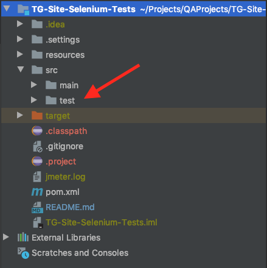
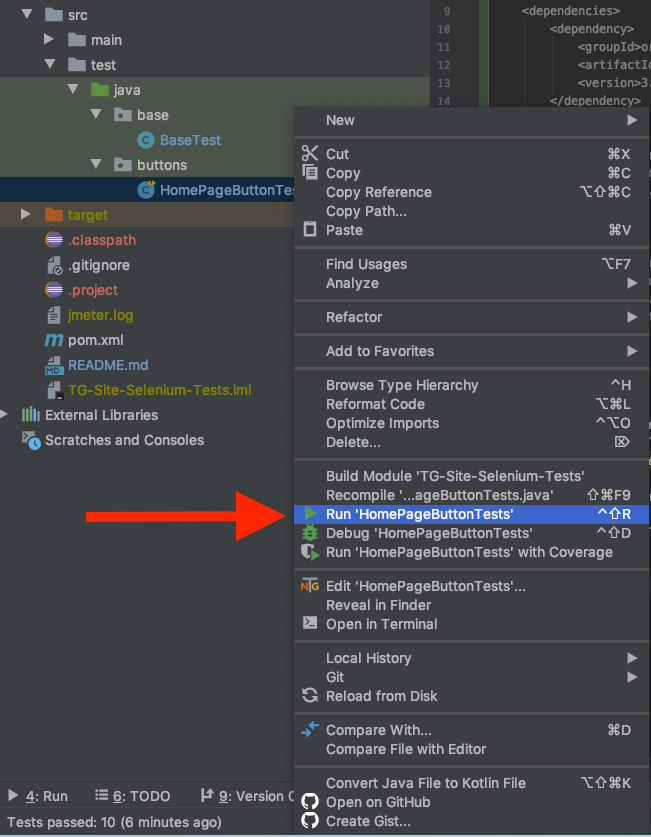
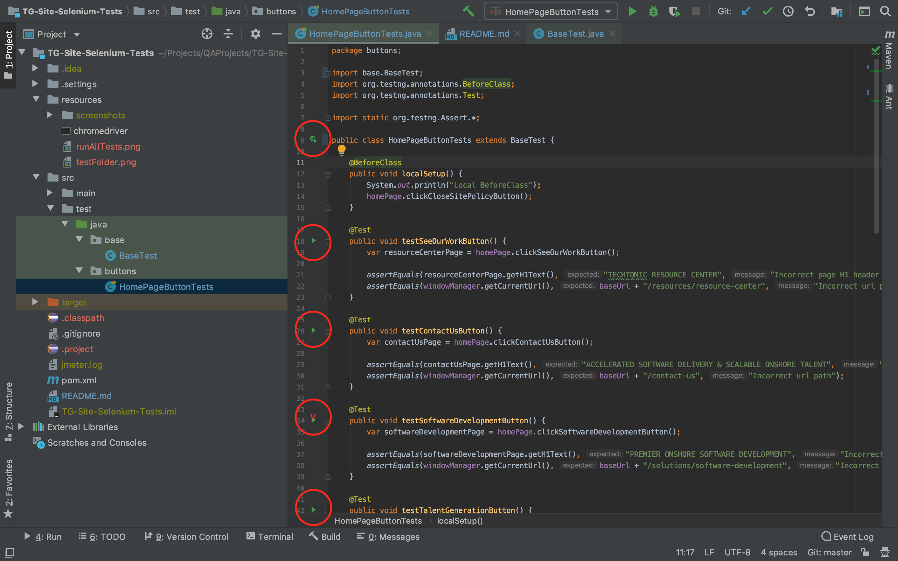

# TG-Site-Selenium-Tests

> Repository to hold Jose's automated Selenium tests, for http://staging.techtonic.com/  
> The examples in this test suite were written using the [TestNG](https://testng.org/doc/) framework.  

## Prerequisites
In order to run these tests make sure you have:  
A Java IDE, [IntelliJ](https://www.jetbrains.com/idea/) recommended.  
Java SE 10 or newer, [Java 11](https://www.oracle.com/java/technologies/javase-jdk11-downloads.html) recommended.  
> Type `java --version` in your terminal to check your version

Chrome Browser installed
> The chromedriver that comes with this project is for Chrome version 80, if you have a different version of Chrome, replace the chromedriver file in the resources folder wit the correct version.  
> https://chromedriver.chromium.org/downloads 

## How-to
Step 1.) Clone down the repo  
Step 2.) In Intellij, click File > Open, select the pom.xml file in the root directory of the project.  
> When prompted to Open Project, select `Open As Project`  
> If this is your first time using Intellij, if prompted to import settings, select `Do Not Import Settings`.  

This project is a Maven project, once Maven is done automatically building the project, you can run any of the tests by navigating to the test folder inside of the src directory.  
  

Within this folder there are 2 packages:  
The base package holds the BaseTest class where the webdriver and test suite configurations are setup.  
The buttons package holds the example test file, HomePageButtonTests, this file holds all the homepage tests.  

You can run all of the tests by right-clicking on the HomePageButtonTests file, and selecting `Run 'HomePageButtonTests'`  
   

You can also run the tests together or individually by selecting the appropriate green play icon on the sidebar of the test file in IntelliJ.  
   

## About
The tests follow the Page Object Model approach, as demonstrated in this TAU course, https://testautomationu.applitools.com/selenium-webdriver-tutorial-java/  

In the main > java directory you will see two packages, pages and utils.  
In the pages package you will see each different Techtonic site page represented by its own java class.  
> Within these class files are the behaviors and actions available only to that page.  
> So while there are only tests written for the Home Page, every page that was navigated to due to some action on the Home Page, needed to be represented by it's own class.  
> This further builds out the scaffolding for you to write in the behaviors of those different Techtonic pages inside their existing class files.

In the utils package are two helpful utilities
> The WindowManager file is leveraged for browser navigation and to interact with different tabs.  
> The EventReporter file contains the scaffolding for you to perform various actions upon the firing of different events, play around in here and see what events you can respond to.  
> The event listener is already set up, this is configured in the BaseTest class, see the @BeforeClass annotation.  

>Happy Testing!

## Project Dependencies
```
    <dependencies>
        <dependency>
            <groupId>org.seleniumhq.selenium</groupId>
            <artifactId>selenium-chrome-driver</artifactId>
            <version>3.141.59</version>
        </dependency>

        <dependency>
            <groupId>org.seleniumhq.selenium</groupId>
            <artifactId>selenium-support</artifactId>
            <version>3.141.59</version>
        </dependency>

        <dependency>
            <groupId>org.testng</groupId>
            <artifactId>testng</artifactId>
            <version>7.0.0</version>
            <scope>test</scope>
        </dependency>
    </dependencies>
   ```
